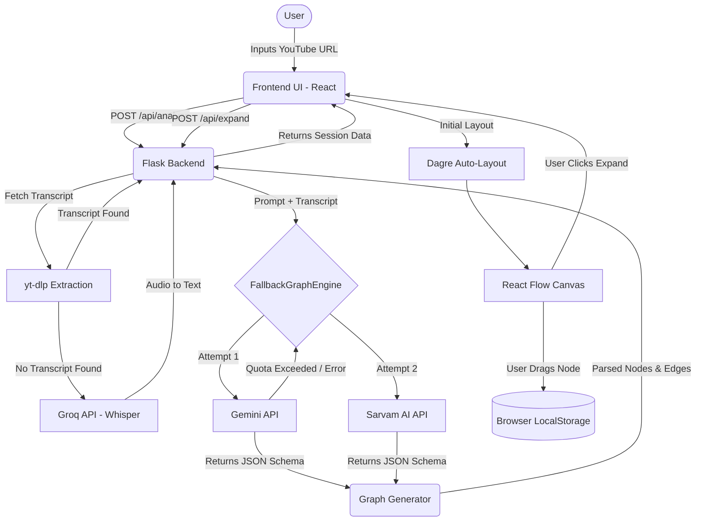

# V2G (Video to Graph)

V2G is an interactive, AI-powered knowledge exploration tool that transforms YouTube videos into dynamic, explorable knowledge graphs. It allows users to visually navigate through the core concepts, topics, and definitions discussed in a video, making learning and comprehension significantly faster and more intuitive.

## ✨ Features
- **YouTube Integration:** Instantly extract transcripts and metadata from any public YouTube video. Fallback audio transcription uses **Groq API (Whisper)** when native transcripts are unavailable.
- **AI-Powered Extraction:** Utilizes advanced LLMs (Primary: Google Gemini, Fallback: Sarvam AI) to semantically analyze transcripts and map out structured knowledge schemas (Nodes and Edges).
- **Interactive Graph Canvas:** Built with React Flow, providing a smooth, zoomable, and draggable canvas to explore concepts.
- **Deep Dive Expansion:** Click on any node to "Expand Branch," prompting the AI to dig deeper into that specific topic and generate sub-concepts.
- **Smart Search:** Instantly locate concepts within massive graphs.
- **Auto-Save & Persistence:** Custom node layouts and historical sessions are automatically saved to your browser's local storage, allowing instant offline reloading.
- **Premium UI/UX:** A stunning dark-mode interface with glassmorphism, dynamic routing, and smooth micro-animations.

---

## 🔄 Program Flow & Architecture

Below is a flowchart detailing how data moves through the V2G system, from the user's input to the final interactive render.



---

## 🚀 Quick Start Guide

### Prerequisites
- Python 3.10+
- [FFmpeg](https://ffmpeg.org/) (Required by yt-dlp)
- A Google Gemini API Key
- A Groq API Key (For Whisper audio transcription)
- A Sarvam AI API Key (Optional, for fallback)

### Installation
1. **Clone the repository and navigate to the directory:**
   ```bash
   cd V2G
   ```

2. **Install the required dependencies:**
   ```bash
   pip install -r requirements.txt
   ```
   *(Note: Ensure you have `flask`, `flask-cors`, `flask-limiter`, `google-genai`, `requests`, and `yt-dlp` installed).*

3. **Configure Environment Variables:**
   Create a `.env` file in the root directory and add your keys:
   ```env
   GEMINI_API_KEY=your_gemini_api_key_here
   GEMINI_MODEL=gemini-2.5-flash
   
   GROQ_API_KEY=your_groq_api_key_here
   GROQ_WHISPER_MODEL=whisper-large-v3-turbo

   SARVAM_API_KEY=your_sarvam_api_key_here
   SARVAM_MODEL=sarvam-105b
   
   # Optional advanced configurations
   MAX_TRANSCRIPT_TOKENS=10000
   ANALYSIS_TOKEN_LIMIT=3000
   ANALYZE_RATE_LIMIT=10/minute
   ```

4. **Run the Application:**
   ```bash
   python app.py
   ```

5. **Explore:**
   Open your browser and navigate to `http://localhost:5000`.

---

## 🧠 Under the Hood & Advanced Mechanisms
- **Intelligent Text Cleaning:** Transcripts are automatically sanitized to remove filler words ("um", "uh", "like") and duplicate sentences before being sent to the AI.
- **Token Management:** Massive transcripts are semantically chunked and strictly limited by configurable token maximums (`MAX_TRANSCRIPT_TOKENS`) to prevent context-window overflow.
- **Rate Limiting:** The `/api/analyze` endpoint is protected by `flask-limiter` to prevent API abuse and quota exhaustion.
- **Stateful Backend Caching:** A custom in-memory `SessionStore` (with TTL) tracks the status of the extraction pipeline ("cleaning", "analyzing", "building_graph") to allow real-time UI updates and prevent redundant processing.

## 🛠 Tech Stack
- **Frontend:** HTML5, Vanilla CSS, React (via CDN), React Flow, Dagre (Auto-layout).
- **Backend:** Python, Flask, Flask-Limiter, In-memory Session TTL.
- **AI Integration:** Google GenAI SDK, Groq (Whisper), Requests (Sarvam API), JSON Schema Enforcement.
- **Data Extraction & Processing:** `yt-dlp` (Video/Audio), Regex (Text Sanitization).

## 📝 License
This project is for educational and demonstrative purposes.
